# Nirnay

**Walk into the bank with your own number.**

**Live demo:** [shubhangini67.github.io/nirnay](https://shubhangini67.github.io/nirnay/) · **Repo:** [github.com/shubhangini67/nirnay](https://github.com/shubhangini67/nirnay)

[](https://shubhangini67.github.io/nirnay/)
[](#stack)
[](#stack)
[](#stack)
[](#run-locally)

Nirnay is a **borrower self-check for India**. No login. No bureau. No server. You answer a short list of questions. It prints four numbers and a one-page card you can hold up at the desk.

**This repository is owned and authored solely by Shubhangini.** There are no other contributors.

| Output | What you walk out with |
|---|---|
| **O1** | Borrow / borrow less / don’t borrow — don’t is a real answer |
| **O2** | Two amounts: what a lender may sanction, and what your household can carry. **Use the second.** |
| **O3** | A fair **rate band**, plus all-in APR with processing fee and GST |
| **O4** | The EMI you should not cross, with a tenure table and one bad-month test |

Then the **walk-in card**: *fair for my profile is 10.8–12.8%, because…*

---

## Run locally

You need **Node 20+**.

```bash
npm install
npm test
npm run dev
```

Open the URL Vite prints (usually `http://localhost:5173`). Or the live app: [shubhangini67.github.io/nirnay](https://shubhangini67.github.io/nirnay/).

```bash
npm run build     # production build
```

Nothing is stored on a server. Answers sit in `sessionStorage` on this browser only, and vanish when the tab does.

---

## Product tour

Screenshots, in the order a borrower actually clicks.

### 1. Home

Four outputs in plain words. Three sample files (Priya, Ravi, Anita) — not anyone’s KYC. Home is one tap away from every screen.

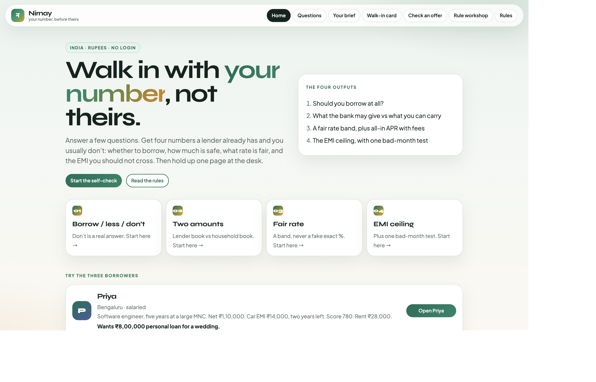

### 2. Nine must questions

One question at a time. Salary, shop, and gig do not see the same list.

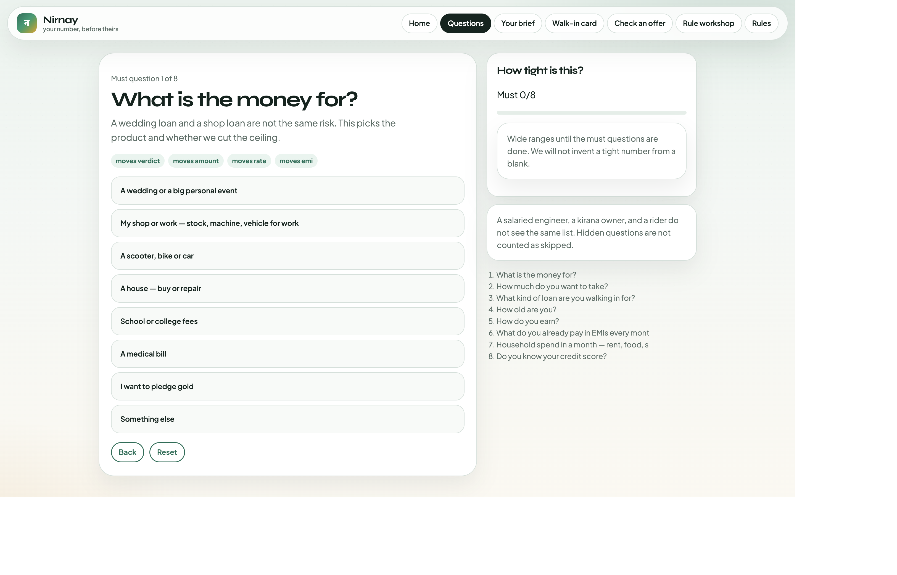

### 3. Extras are optional

Each extra wears a chip: *moves rate*, *moves amount*. Skip one, or skip the rest and still print a brief. Silence keeps the band wide. It does not invent a zero.

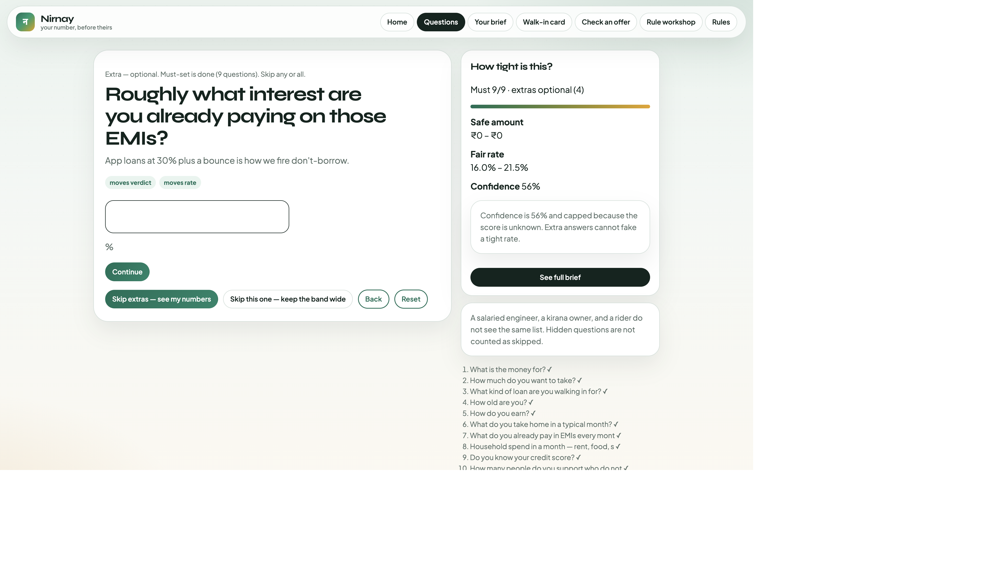

### 4. Brief — Priya (salaried, wedding)

Borrow less than ₹8L. The bank number and the household number are not the same.

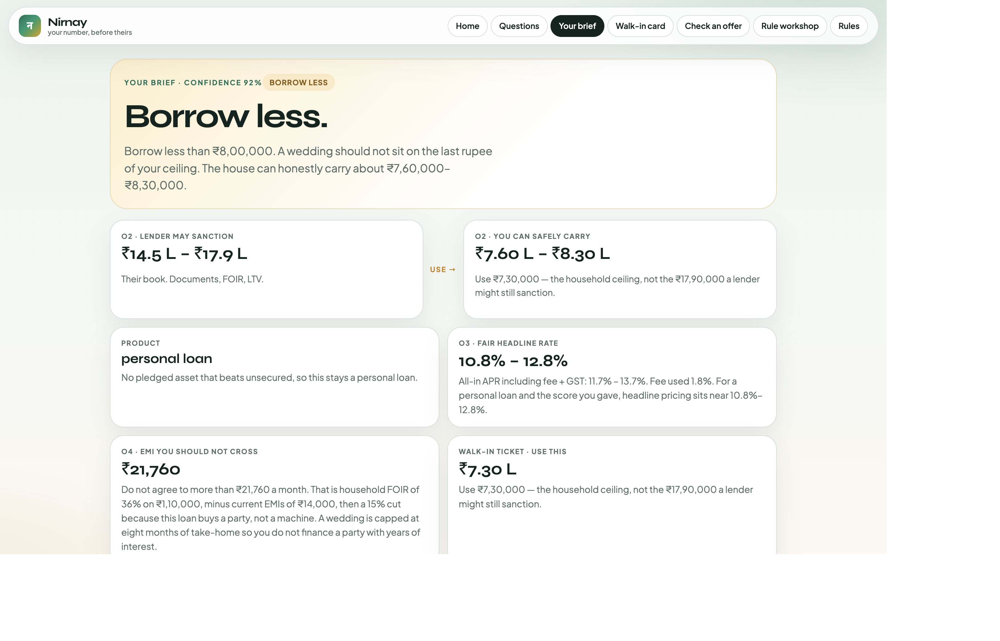

### 5. Walk-in card

One page for the desk. Print it. The first sentence is what she actually says.

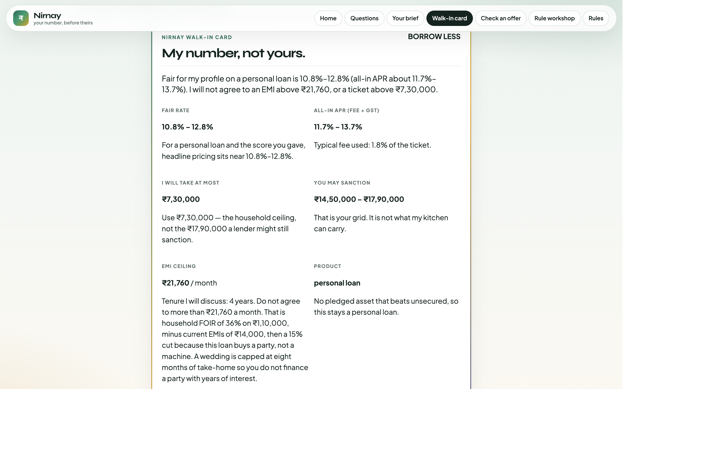

### 6. Offer checker

They quote 14%. The card already had the band. This screen names it: fair / a bit high / expensive / predatory, with APR including fee + GST.

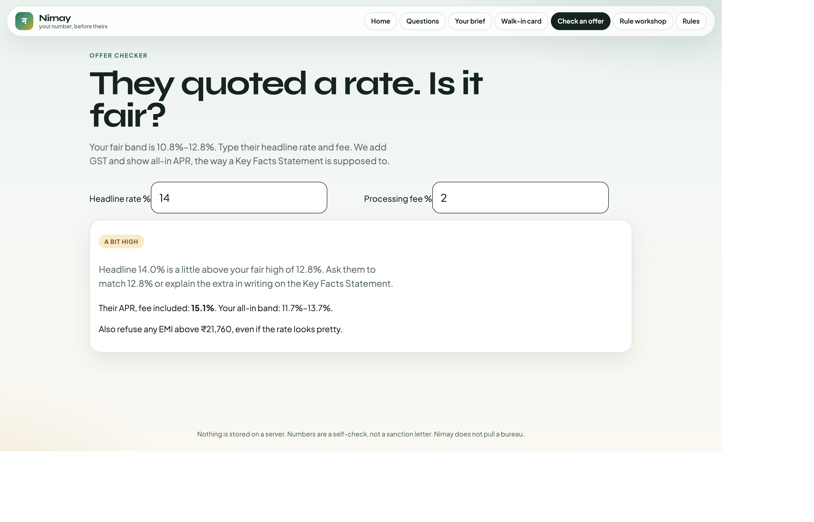

### 7. Rule workshop

For the live follow-up. Load a borrower. Drag household FOIR or LAP LTV. The brief moves. Same engine as the screens.

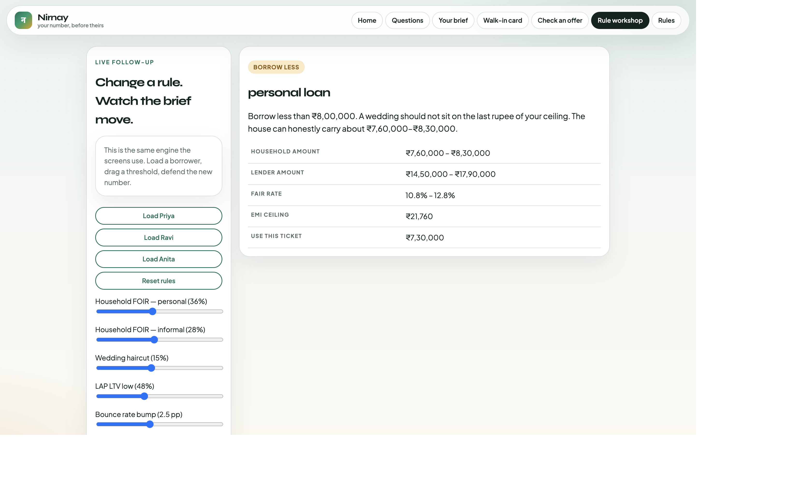

### 8. Ravi — shop loan, unknown score

He asked for a personal loan. The file becomes a **loan against the shop**. Unknown is a wide band, not 300.

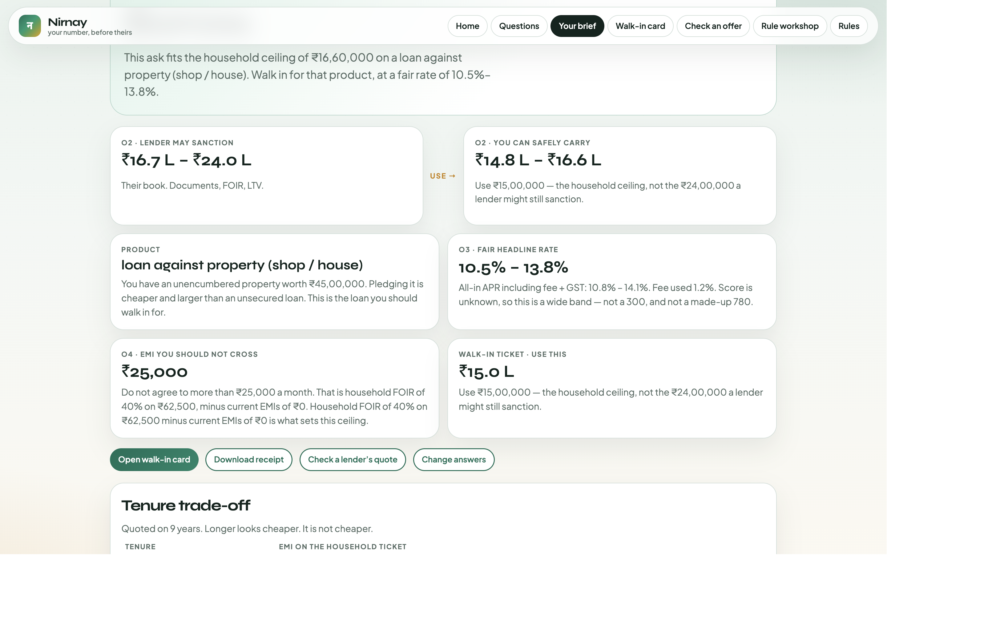

### 9. Anita — don’t borrow

A bounce plus 32% app paper. Don’t borrow. A scooter counter may still pitch ₹70k–₹1.2L. Household is **₹0**.

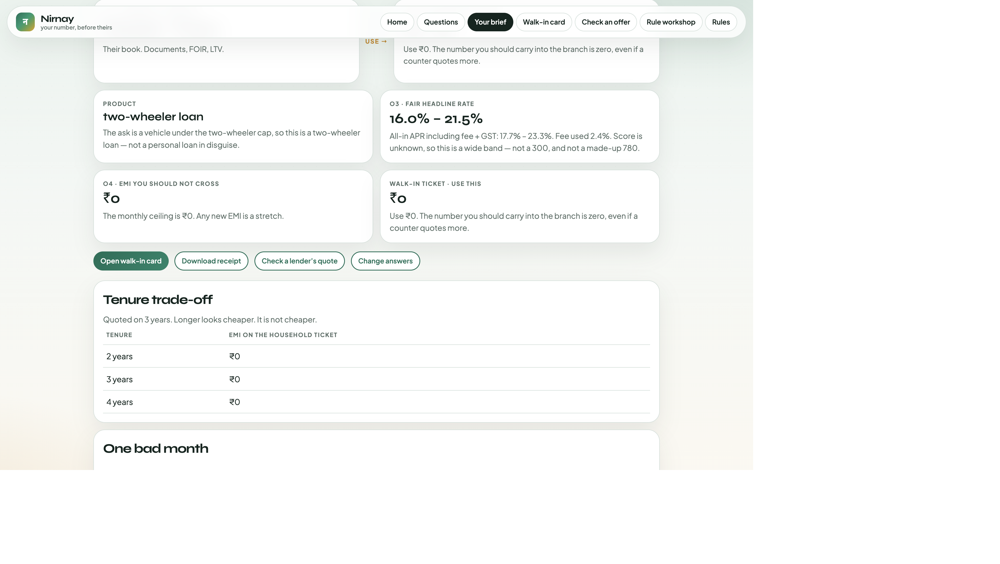

### 10. Every rule

The same catalog as `RULES.md`, inside the app.

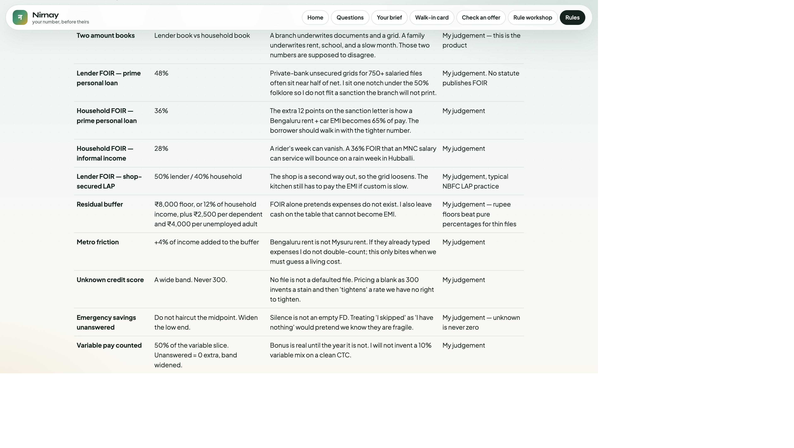

---

## High-level system design

Nirnay is a **client-only** app. The browser *is* the product. There is no API, no database, no auth, no bureau.

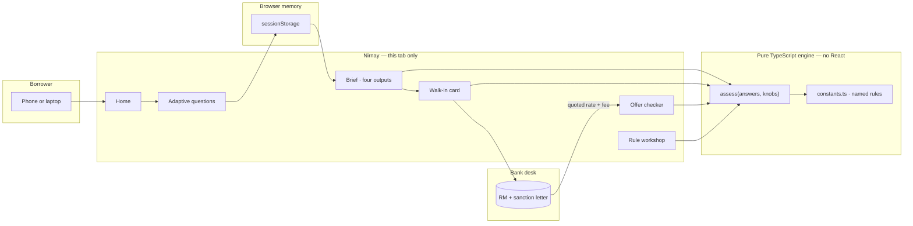

A borrower walks in with the card. The desk quotes a number. The offer checker compares it to the same band the card already printed.

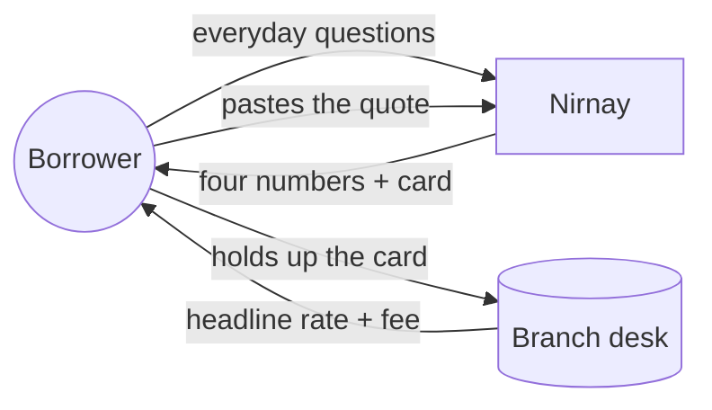

### Layers

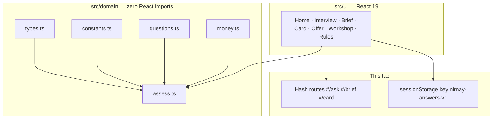

Change a constant. Every screen moves. That is the follow-up.

### One check, end to end

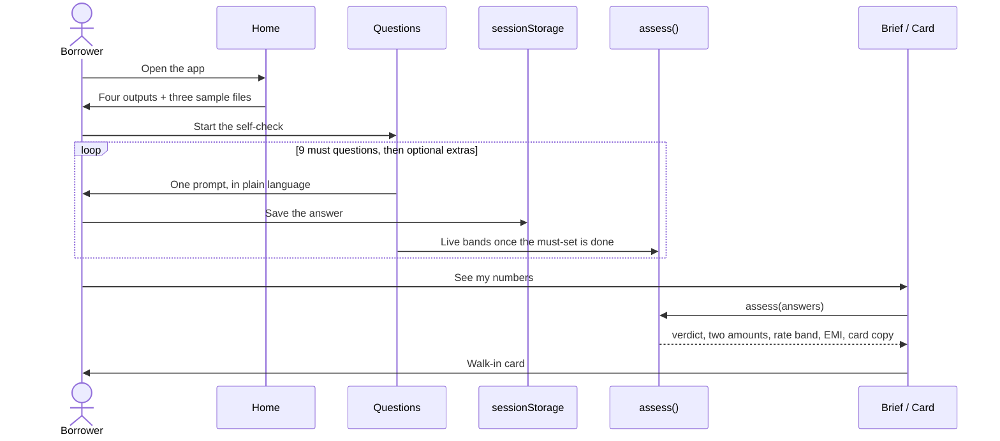

---

## Low-level design — the engine

`assess()` is a pipeline. The UI never invents a rupee.

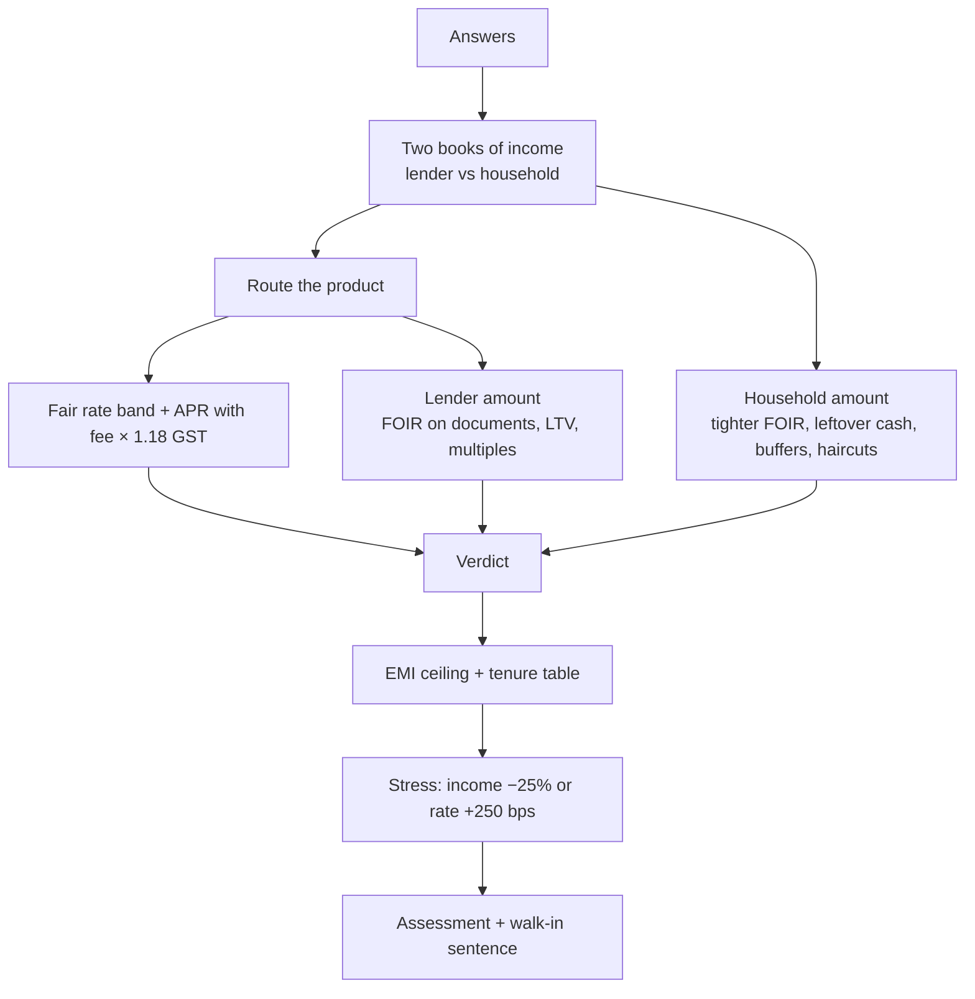

### Why two books

| Number | What it is | What it is not |
|---|---|---|
| **Lender amount** | FOIR on *documented* income (payslip or ITR), LTV on pledged asset | What you should take |
| **Household amount** | FOIR on *cash the kitchen actually sees*, plus buffers and haircuts | The RM’s monthly target |

Priya: a prime MNC file can print ₹14–18L. The house should use ~₹7.3L.
Ravi: the branch uses ITR ÷ 12 and the shop. He lives on a slow month at the till.
Anita: a scooter counter can still quote ₹70k–₹1.2L. Household is **₹0**.

Unknown credit score is a **wide band**. It is never priced as 300. Skipped savings are not an empty FD.

### Product routing (why Ravi is not on a personal loan)

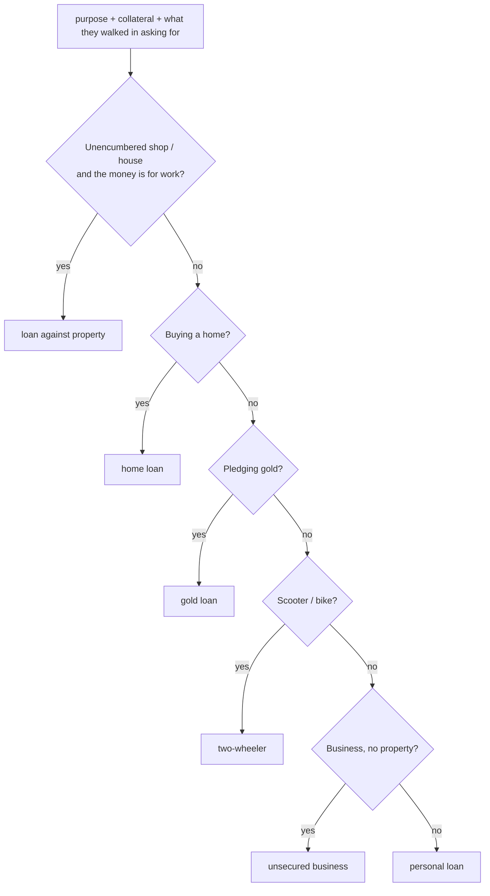

### Verdict

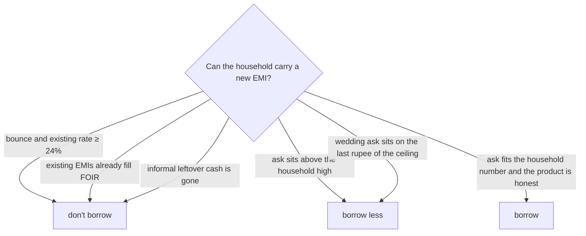

### APR

Headline rate is not the cost. All-in APR is the IRR on net disbursal after **fee × 1.18 GST**, in the spirit of an RBI Key Facts Statement. That is what the offer checker compares to a quote.

---

## Stack

| Layer | Choice | Why |
|---|---|---|
| UI | Vite 6 + React 19 + TypeScript | One command, runs in under 5 minutes, works on a phone |
| Engine | Pure TypeScript in `src/domain/` | Zero React imports. Change a constant — or a workshop slider — and the number moves |
| Routes | Hash (`#/ask`, `#/brief`, `#/card`) | Static host. No server rewrite. |
| State | `sessionStorage` | No login, no PII on a server, tab-scoped |
| Tests | Vitest — Priya / Ravi / Anita + question design | Domain rules, not button clicks |
| Style | Custom CSS · Syne + Plus Jakarta Sans | Readable in daylight, printable card |

I did not add auth, Postgres, Redis, Docker, a bureau, or a model. They would store people and slow the first run from this README.

---

## Repository map

```
src/domain/     types, constants, questions, assess, money, personas   ← no UI
src/ui/         Home, Interview, Brief, Card, Offer, Workshop, Rules
src/styles.css  daylight layout
docs/screenshots/
RULES.md        every threshold: what · value · why · source
RUNTHROUGHS.md  Priya, Ravi, Anita
WALKTHROUGH.md  five-minute tour, what I would add, what I would cut
```

| File | What |
|---|---|
| [`RULES.md`](RULES.md) | Every threshold, why, and what I do not know |
| [`RUNTHROUGHS.md`](RUNTHROUGHS.md) | The questions each borrower saw, the four outputs, the card |
| [`WALKTHROUGH.md`](WALKTHROUGH.md) | What to click, what I would build next, what I would leave out |

All knobs are named exports in [`src/domain/constants.ts`](src/domain/constants.ts). The screens never hard-code a FOIR or a rate.

---

## Assignment checklist

Lokta Borrower Copilot Challenge · v1.0 · issued 2 Sep 2026.

| Requirement | Status | Where |
|---|---|---|
| No login, no bureau, no personal data stored | Done | Client-only, `sessionStorage` |
| O1 Borrow / don’t / borrow less, and don’t is reachable | Done | Anita; also FOIR-full salaried path |
| O2 Two amounts, clearly separated; say which to use | Done | Brief twin cards · *use the household number* |
| O3 Fair rate as a **band**, plus all-in APR with fee | Done | Brief + card + offer checker |
| O4 EMI ceiling, tenure trade-off, one stress case | Done | Income −25% or rate +250 bps |
| Negotiation card a borrower can hold up | Done | `#/card`, printable |
| Must questions ~8–10; must-set alone still works | Done | **9** visible must questions; extras skippable |
| Every extra question moves a number | Done | `moves` on each question + Vitest |
| Adaptive paths (salaried ≠ kirana ≠ gig) | Done | `showIf` on the question graph |
| Confidence widens with silence | Done | Skip extras → wider band, lower confidence |
| Unknown is never zero / never 300 | Done | Unknown score = wide band, confidence cap 56% |
| Every number has a why in one sentence | Done | `verdictWhy`, `emiCeilingWhy`, `rateWhy` |
| India, ₹, FOIR, RBI-style APR | Done | Products: home, LAP, personal, gold, 2W, business |
| Priya, Ravi, Anita as act-on-tomorrow files | Done | Home demos + `RUNTHROUGHS.md` |
| Ravi routed to a secured product | Done | Personal-loan ask → **LAP** |
| Working app, README runs in under 5 minutes | Done | Vite, no backend |
| `RULES.md` as what · value · why · source | Done | Root |
| Three run-throughs | Done | `RUNTHROUGHS.md` |
| Five-minute walkthrough, next / cut | Done | `WALKTHROUGH.md` |
| Rules separated from UI (follow-up: change a rule live) | Done | Engine + Rule workshop |
| Honesty about limits | Done | Ochre guesses on the brief; “what I do not know” in `RULES.md` |
| Works on a phone | Done | Single-column layout under 860px |

**Extra on purpose (not required, but they earn their place):** skip-the-rest after the must-set, offer checker vs a pasted quote, downloadable HTML receipt, live rule workshop for the 60-minute follow-up.

---

## Author

**Shubhangini** — sole owner and sole author of Nirnay.

This take-home is my work: product, rules, engine, UI, copy, tests, and this write-up.
